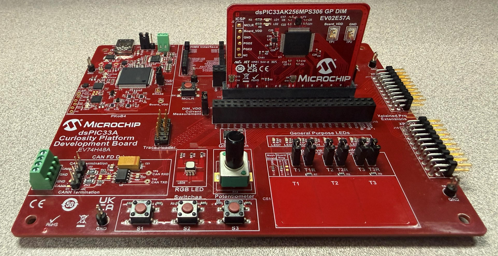

<picture>
    <source media="(prefers-color-scheme: dark)" srcset="../images/microchip_logo_white_red.png">
	<source media="(prefers-color-scheme: light)" srcset="../images/microchip_logo_black_red.png">
    
</picture>

# dsPIC33AK256MPS306 wolfCrypt Projects

## Software Tool Versions Used

- dsPIC33AK-MP_DFP **v1.3.185**
- MPLAB® X IDE **v6.30** (https://www.microchip.com/mplabx)
- MPLAB® XC-DSC Compiler **v3.31** (https://www.microchip.com/xcdsc)

## Hardware Used

- dsPIC33AK256MPS306 Curiosity GP DIM (https://www.microchip.com/EV02E57A)
- Curiosity Platform Development Board (https://www.microchip.com/EV74H48A)

## Hardware Setup

1. Insert the dsPIC33AK256MPS306 DIM into the DIM J1 slot on the Curiosity Platform Development Board.
2. Connect the board from the J24 USB-C PKoB4 (PICKit™ On-Board 4) to the computer.

    
