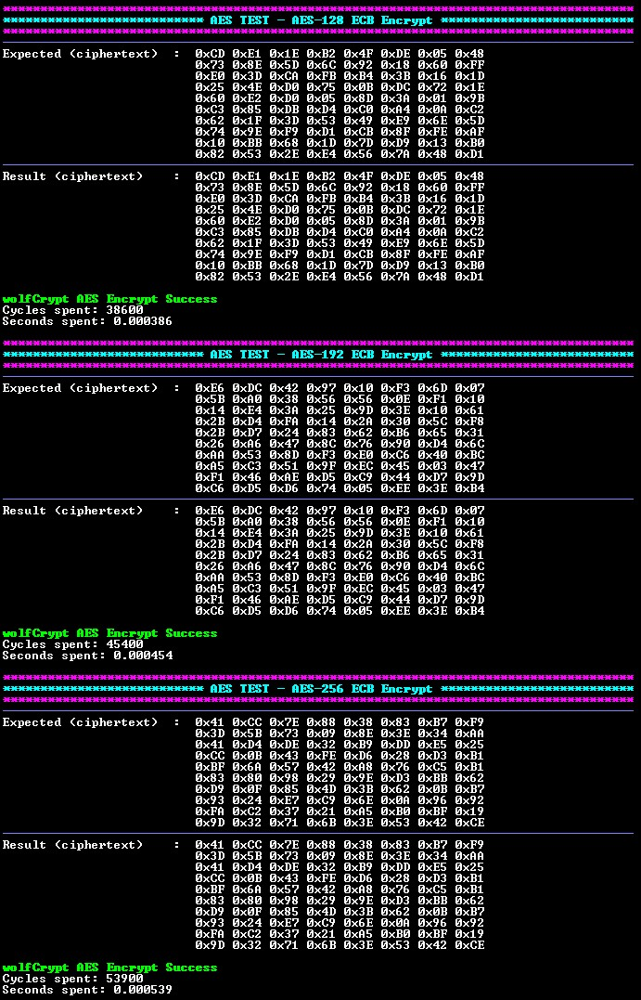
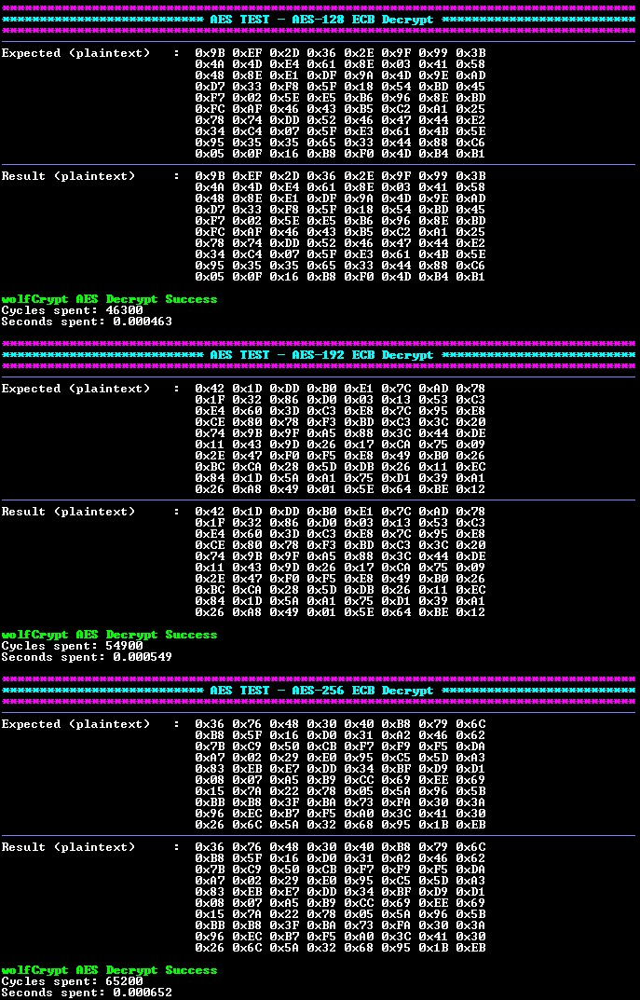
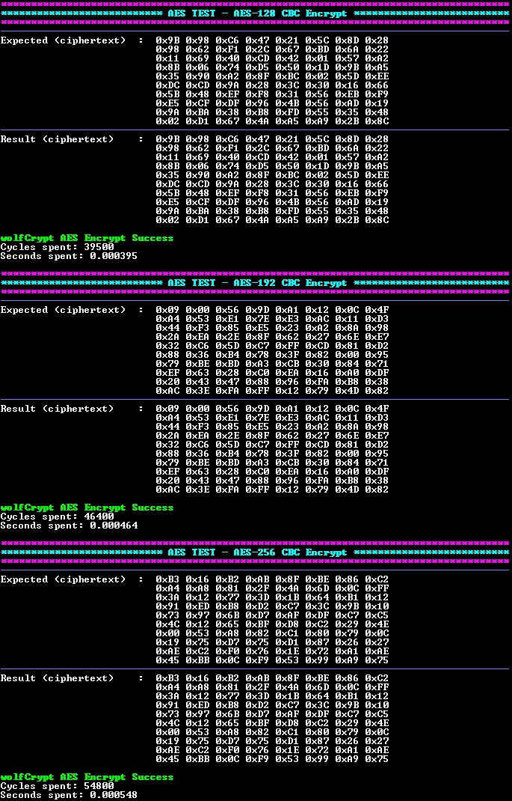

<picture>
    <source media="(prefers-color-scheme: dark)" srcset="../../images/microchip_logo_white_red.png">
	<source media="(prefers-color-scheme: light)" srcset="../../images/microchip_logo_black_red.png">
    
</picture>

# dsPIC33C AES (Advanced Encryption Standard) Example

## Summary

This MPLAB® X project demonstrates AES processing by using wolfCrypt APIs on a dsPIC33CK256MP508 device.

## Software Used 
- MPLAB® X IDE **v6.25** or newer (https://www.microchip.com/mplabx)
- MPLAB® XC-DSC Compiler **v3.21** or a newer compiler (https://www.microchip.com/xcdsc)

## Hardware Used

- dsPIC33CK Curiosity Development Board (https://www.microchip.com/dm330030)
- dsPIC33CK256MP508 High-Performance DSC (https://www.microchip.com/dspic33ck256mp508)

## Benchmarking

### Memory Usage

| AES Mode          | Direction                   | RAM (bytes) | Flash (words) |
| ----              | ---------                   | ----------- | ------------- |
| ECB               | Encrypt                     | 120         | 9,860         |
| ECB               | Decrypt                     | 120         | 9,775         |
| CBC               | Encrypt                     | 120         | 10,446        |
| CBC               | Decrypt                     | 120         | 10,308        |
| All Modes Enabled | Encrypt and Decrypt Enabled | 120         | 13,458        |

### Performance

| AES Key Size | AES Mode | Direction | Plaintext/Ciphertext Size (bytes) | Initialization Vector Size (bytes) | Cycles | Time (seconds) |
| ------------ | -------- | --------- | --------------------------------- | ---------------------------------- | ------ | -------------- |
| AES-128      | ECB      | Encrypt   | 80                                | N/A                                | 38,600 | 0.000386       |
| AES-192      | ECB      | Encrypt   | 80                                | N/A                                | 45,500 | 0.000455       |
| AES-256      | ECB      | Encrypt   | 80                                | N/A                                | 53,900 | 0.000539       |
| AES-128      | ECB      | Decrypt   | 80                                | N/A                                | 46,400 | 0.000464       |
| AES-192      | ECB      | Decrypt   | 80                                | N/A                                | 55,100 | 0.000551       |
| AES-256      | ECB      | Decrypt   | 80                                | N/A                                | 65,500 | 0.000655       |
| AES-128      | CBC      | Encrypt   | 80                                | 16                                 | 39,300 | 0.000393       |
| AES-192      | CBC      | Encrypt   | 80                                | 16                                 | 46,500 | 0.000465       |
| AES-256      | CBC      | Encrypt   | 80                                | 16                                 | 54,900 | 0.000549       |
| AES-128      | CBC      | Decrypt   | 80                                | 16                                 | 48,400 | 0.000484       |
| AES-192      | CBC      | Decrypt   | 80                                | 16                                 | 57,200 | 0.000572       |
| AES-256      | CBC      | Decrypt   | 80                                | 16                                 | 67,400 | 0.000674       |

## Set up

### Hardware Set up

1. Connect the board to the computer using a USB cable, connecting to the PICkit™ On-Board (PKOB) programmer/debugger.

    

### Project Set Up

#### Replacing Stubbed Files with wolfCrypt Source
The wolfCrypt files in this project are stubbed and should be replaced with the source provided on the wolfSSL [GitHub](https://github.com/wolfSSL/wolfssl/tree/v5.8.2-stable). This README expects v5.8.2 to be used. The cloned repo can be renamed to `wolfssl` and copied into the crypto folder thus replacing the stubbed files. Each stubbed wolfCrypt file also contains a direct web link to itself within the GitHub repo.

* Source files can be found in the `<wolfSSL GitHub Repo>\wolfcrypt\src` directory.
* Header files can be found in the `<wolfSSL GitHub Repo>\wolfssl\wolfcrypt` directory.

### wolfCrypt Library Set Up
The configuration of the wolfCrypt library is controlled by macros specified in the `user_settings.h` file. This file enables AES APIs, sets up 16-bit support, and includes additional configuration options. More information about the options can be found within the `user_settings.h` file.

## Running the Demo

Open the project in MPLAB® X IDE. Build the project and program the device.

### Demo Configuration

The `app_config.h` file is used to configure the project. The following options are available:

| Algorithm | Direction        | Mode     |
| --------- | ---------        | ----     |
| AES-128   | Encrypt, Decrypt | ECB, CBC |
| AES-192   | Encrypt, Decrypt | ECB, CBC |
| AES-256   | Encrypt, Decrypt | ECB, CBC |

### Demo Output

The resulting plaintext/ciphertext arrays are compared to expected output. The final status is then printed to the terminal using UART and the following settings:

| Setting           | Value  
| -------           | -----  |
| Baudrate          | 115200 |
| Parity            | None   |
| Data Size         | 8      |
| Stop Bits         | 1      |
| Flow Control Mode | None   |

### Demo Execution

The device will process the configured test vector using the following APIs:

#### AES-ECB

* `wc_AesInit` - Initializes the AES structure.
* `wc_AesSetKey` - Further initializes the AES structure with the key information.
* `wc_AesEcbEncrypt` - Encrypts the given plaintext using ECB mode.
* `wc_AesEcbDecrypt` - Decrypts the given ciphertext using ECB mode.

##### Encrypt

##### Decrypt

#### AES-CBC

* `wc_AesInit` - Initializes the AES structure.
* `wc_AesSetKey` - Further initializes the AES structure with the key and initialization vector information.
* `wc_AesCbcEncrypt` - Encrypts the given plaintext using CBC mode.
* `wc_AesCbcDecrypt` - Decrypts the given ciphertext using CBC mode.

##### Encrypt

##### Decrypt

## Licensing

This project is for evaluation purposes only. The project is governed under an End User License Agreement (EULA) with wolfSSL. More information can be found within the included `WolfSSL_EULicense_Microchip.md` file.