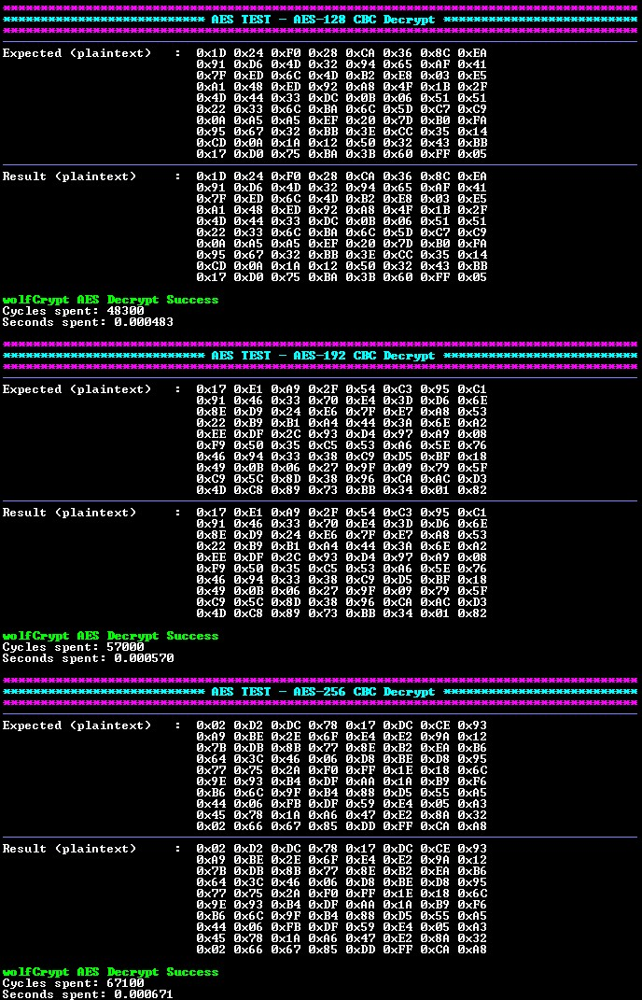

<picture>
    <source media="(prefers-color-scheme: dark)" srcset="../../images/microchip_logo_white_red.png">
	<source media="(prefers-color-scheme: light)" srcset="../../images/microchip_logo_black_red.png">
    
</picture>

# dsPIC33C AES (Advanced Encryption Standard) Example Application

## Description

This MPLAB® X project demonstrates AES processing by using wolfCrypt APIs on a dsPIC33CK256MP508 device. The following AES algorithms are supported:
- ECB
- CBC

## Running the Application

1. Within MPLAB® X IDE, open the dspic33ck256mp508-aes.X application project in dspic33ck256mp508/aes.
2. Open the app_config.h file found at dspic33ck256mp508/aes/dspic33ck256mp508-aes.X/app. In this file, each key length, algorithm, and direction can be enabled or disabled.
3. Open the user_settings.h file found at dspic33ck256mp508/aes/dspic33ck256mp508-aes.X/app. The configuration of the wolfCrypt library is controlled by macros specified in this file. This file enables AES APIs, sets up 16-bit support, and includes additional configuration options.
4. Build and Program the application using MPLAB® X IDE.
5. The printed information can be found on the serial COM port reading at a speed of 115200.

## Application Results
### AES ECB and CBC Results
The following information will be printed on the COM port for symmetric AES algorithms:
1. A header is displayed showing the used AES algorithm, input data length, and direction.
2. The expected result is printed out. This is the array that the output of the algorithm will be compared against.
3. The result obtained from the operation is printed out.
4. Success or Failure is printed out depending on the comparison between the two arrays.
5. The number of cycles spent running the operation is printed out. This is obtained using the Timer module.
6. The number of seconds spent running the operation is printed out. This value is obtained from the cycles spent running the operation.

Example output:

## wolfCrypt APIs

The wolfCrypt files in this project use wolfssl v5.8.4-stable release to support the dsPIC33C device.

### AES-ECB

* `wc_AesInit` - Initializes the AES structure.
* `wc_AesSetKey` - Further initializes the AES structure with the key information.
* `wc_AesEcbEncrypt` - Encrypts the given plaintext using ECB mode.
* `wc_AesEcbDecrypt` - Decrypts the given ciphertext using ECB mode.

### AES-CBC

* `wc_AesInit` - Initializes the AES structure.
* `wc_AesSetKey` - Further initializes the AES structure with the key and initialization vector information.
* `wc_AesCbcEncrypt` - Encrypts the given plaintext using CBC mode.
* `wc_AesCbcDecrypt` - Decrypts the given ciphertext using CBC mode.

## Licensing

The project is governed under the End User License Agreement (EULA) with wolfSSL. The EULA can be found within the MPLAB® X project folder called [LICENSE_WOLFSSL_MICROCHIP](./dspic33ck256mp508-aes.X/crypto/wolfssl/LICENSE_WOLFSSL_MICROCHIP_v12052025.txt).

## Benchmarking

### Performance
The following benchmarking results were obtained with the device clock speed set to 200MHz.

#### AES-ECB

|Key Size (bytes)|Plaintext Size (bytes)|Encryption Performance (seconds)|
|----|----|----|
|16|80|0.000404|
|24|80|0.000472|
|32|80|0.000550|

|Key Size (bytes)|Plaintext Size (bytes)|Decryption Performance (seconds)|
|----|----|----|
|16|80|0.000492|
|24|80|0.000578|
|32|80|0.000673|

#### AES-CBC
|Key Size (bytes)|Initialization Vector Size (bytes)|Plaintext Size (bytes)|Encryption Performance (seconds)|
|----|----|----|----|
|16|16|80|0.000417|
|24|16|80|0.000483|
|32|16|80|0.000560|

|Key Size (bytes)|Initialization Vector Size (bytes)|Ciphertext Size (bytes)|Decryption Performance (seconds)|
|----|----|----|----|
|16|16|80|0.000513|
|24|16|80|0.000601|
|32|16|80|0.000694|

### Memory Size Benchmarking
The following results include usage of ECB and CBC APIs. Flash size will vary based on size of the stored data inputs used with the library.

|AES Mode|Direction|FLASH (bytes)|RAM Static (bytes)|RAM Stack (bytes)|
|----|----|----|----|----|
|ECB              |Encrypt            |7,987|480|116|
|ECB              |Decrypt            |7,965|480|116|
|CBC              |Encrypt            |8,078|480|116|
|CBC              |Decrypt            |8,069|480|116|
|All Modes Enabled|Encrypt and Decrypt|10,644|480|116|