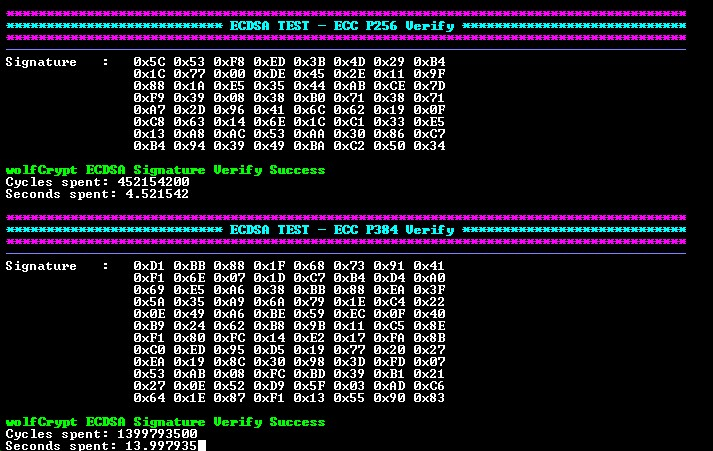

<picture>
    <source media="(prefers-color-scheme: dark)" srcset="../../images/microchip_logo_white_red.png">
	<source media="(prefers-color-scheme: light)" srcset="../../images/microchip_logo_black_red.png">
    
</picture>

# dsPIC33C ECDSA (Elliptic Curve Digital Signature Algorithm) Verification Example

## Summary

This MPLAB® X project demonstrates ECDSA verification by using wolfCrypt APIs on a dsPIC33CK256MP508 device.

## Hardware Used

- dsPIC33CK Curiosity Development Board (https://www.microchip.com/dm330030)
- dsPIC33CK256MP508 High-Performance DSC (https://www.microchip.com/dspic33ck256mp508)

## Set up

### Hardware Set up

1. Connect the board to the computer using a USB cable, connecting to the PICkit™ On-Board (PKOB) programmer/debugger.

    

### Project Set Up

#### wolfCrypt Source

The wolfCrypt files in this project use wolfssl v5.8.4-stable release to support the dsPIC33C device.

## Running the Demo

Open the project in MPLAB® X IDE. Build the project and program the device.

### Demo Configuration

The `app_config.h` file is used to configure the project. The following options are available:

| ECC Curve  | Application                  |
| ---------- | -----------                  |
| P256       | ECDSA Signature Verification | 
| P384       | ECDSA Signature Verification |

### Demo Output

The resulting verification status is then printed to the terminal using UART with the following settings:

| Setting           | Value  
| -------           | -----  |
| Baudrate          | 115200 |
| Parity            | None   |
| Data Size         | 8      |
| Stop Bits         | 1      |
| Flow Control Mode | None   |

### Demo Execution

The device will process the configured test vector using the following APIs:

#### ECDSA Signature Verification

* `wc_ecc_init` - Initializes the ECC key structure.
* `wc_ecc_import_unsigned` - Further initializes the ECC key structure with the key information.
* `wc_ecc_verify_hash` - Verifies the hash and signature against the selected curve.

### Test Vectors

The NIST test vectors used in this project are found in the following [repo](https://github.com/usnistgov/ACVP-Server/blob/v1.1.0.40/gen-val/json-files/ECDSA-SigVer-1.0/internalProjection.json).

## Licensing

The project is governed under the End User License Agreement (EULA) with wolfSSL. The EULA can be found within the MPLAB® X project folder called [LICENSE_WOLFSSL_MICROCHIP](./dspic33ck256mp508-ecdsa.X/LICENSE_WOLFSSL_MICROCHIP_v12052025.txt).

## Benchmarking for ECDSA Verification

### Verification Time

| ECC Curve    | Cycles        | Time (seconds) |
| ------------ | ------------- | -------------- |
| P256         |   382,190,400 |  3.821904      |
| P384         | 1,143,803,600 | 11.438036      |

### Verification Size

|ECC Curve | Flash (bytes) | RAM Static (bytes) | RAM Stack (bytes) |
| -------- | ------------- | ------------------ | ----------------- |
| P256     | 19,635        | 124                |  6,150            |
| P384     | 19,675        | 124                |  6,150            |
