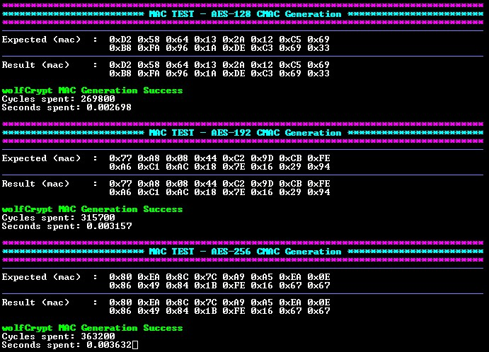

<picture>
    <source media="(prefers-color-scheme: dark)" srcset="../../images/microchip_logo_white_red.png">
    <source media="(prefers-color-scheme: light)" srcset="../../images/microchip_logo_black_red.png">
    
</picture>

# dsPIC33C Message Authentication Code (MAC) Example

## Description
This example application utilizes the wolfCrypt library to perform MAC operations using different sized input vectors. The following MAC algorithms are supported:
- AES-CMAC

## Software Tool Versions Used
- dsPIC33CK-MP_DFP v1.15.423
- MPLAB® X IDE [v6.30](https://www.microchip.com/mplabx)
- MPLAB® XC-DSC Compiler [v3.30](https://www.microchip.com/xcdsc)

## Setting Up The Hardware
- dsPIC33CK Curiosity Development Board ([DM330030](https://www.microchip.com/dm330030))
- dsPIC33CK256MP508 High-Performance DSC (https://www.microchip.com/dspic33ck256mp508)

1. Connect the board to the computer using a USB cable, connecting to the PICkit™ On-Board (PKOB) programmer/debugger.

    

## Running the Application
1. Within MPLAB® X IDE, open the dspic33ck256mp508-mac.X application project.
    - (Optional) To run all added test vectors uncomment the RUN_ALL_VECTORS definition on line 73 in mac/mac.X/app_mac.h
2. Build and Program the application using MPLAB® X IDE.
3. The printed information can be found on the serial COM port reading at a speed of 115200.

## Application Results

### AES-CMAC
The following information will be printed on the COM port for AES-CMAC algorithms:
1. A header is displayed showing the used AES-CMAC algorithm and input message length.
2. The expected MAC is printed out. This is the array that the output of the algorithm will be compared against.
3. The result obtained from the operation is printed out.
4. Success or Failure is printed out depending on the comparison between the two arrays.
5. The number of cycles spent running the operation is printed out. This is obtained using the Timer module.
6. The number of seconds spent running the operation is printed out. This value is obtained from the cycles spent running the operation.

## wolfCrypt APIs

### AES-CMAC APIs

* `wc_InitCmac` - Initializes the CMAC structure.
* `wc_CmacUpdate` - Processes input data for a CMAC operation and updates the CMAC context.
* `wc_CmacFinal` - Retrieves the final CMAC value.

## Licensing

The project is governed under the End User License Agreement (EULA) with wolfSSL. The EULA can be found within the MPLAB® X project folder called [LICENSE_WOLFSSL_MICROCHIP](./dspic33ck256mp508-mac.X/LICENSE_WOLFSSL_MICROCHIP_v12052025.txt). 

## Benchmarking

### Performance Benchmarking
The following benchmarking results were obtained with the device clock speed set to 100MHz.

#### AES-CMAC
|Key Size (bytes)|Plaintext Size (bytes)|MAC Size (bytes)|Generation Performance (seconds)|
|----|----|----|----|
|16|532|16|0.002837|
|24|532|16|0.003277|
|32|532|16|0.003717|

### Memory Size Benchmarking
The following results include usage of AES-CMAC APIs. Flash size will vary based on size of the stored data inputs used with the library.

|Mode|FLASH (bytes)|RAM Static (bytes)|RAM Stack (bytes)|
|----|----|----|----|
|AES-CMAC|9,239|528|164|