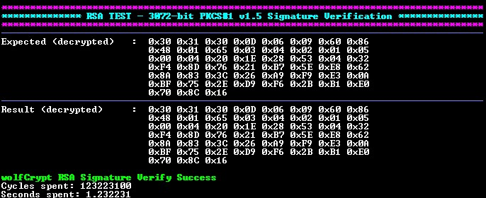

<picture>
    <source media="(prefers-color-scheme: dark)" srcset="../../images/microchip_logo_white_red.png">
	<source media="(prefers-color-scheme: light)" srcset="../../images/microchip_logo_black_red.png">
    
</picture>

# dsPIC33C RSA (Rivest–Shamir–Adleman) Verification Example

## Summary

This MPLAB® X project demonstrates RSA Verification by using wolfCrypt APIs on a dsPIC33CK256MP508 device.

## Software Used 
- MPLAB® XC-DSC Compiler **v3.30** (https://www.microchip.com/xcdsc)
    - Optimization level 3 is required for this demo.

## Hardware Used

- dsPIC33CK Curiosity Development Board (https://www.microchip.com/dm330030)
- dsPIC33CK256MP508 High-Performance DSC (https://www.microchip.com/dspic33ck256mp508)

## Set up

### Hardware Set up

1. Connect the board to the computer using a USB cable, connecting to the PICkit™ On-Board (PKOB) programmer/debugger.

    

### Project Set Up

#### wolfCrypt Source

The wolfCrypt files in this project use wolfssl v5.8.4-stable release to support the dsPIC33C device.

## Running the Demo

Open the project in MPLAB® X IDE. Build the project and program the device.

### Demo Configuration

The `app_config.h` file is used to configure the project. The following options are available:

| RSA Key Size (bits) | Padding Type | Application            |
| ------------------- | ------------ | -----------            |
| 3072                | PKCS#1 v1.5  | Signature Verification |

### Demo Output

The result data is compared to expected output. The final status is then printed to the terminal using UART and the following settings:

| Setting           | Value  
| -------           | -----  |
| Baudrate          | 115200 |
| Parity            | None   |
| Data Size         | 8      |
| Stop Bits         | 1      |
| Flow Control Mode | None   |

### Demo Execution

The device will process the configured test vector using the following APIs:

#### RSA PKCS#1 v1.5 Signature Verification

* `wc_InitRsaKey` - Initializes the RSA key structure.
* `mp_read_unsigned_bin` - Initializes the RSA key structure with the RSA modulus.
* `mp_set_int` - Initializes the RSA key structure with the public exponent.
* `wc_RsaSSL_Verify` - Processes the signature and returns the decrypted output.

### Test Vectors

The NIST test vectors used in this project are found at the following [repo](https://github.com/usnistgov/ACVP-Server/blob/v1.1.0.40/gen-val/json-files/RSA-SigVer-FIPS186-5/internalProjection.json).

## Licensing

The project is governed under the End User License Agreement (EULA) with wolfSSL. The EULA can be found within the MPLAB® X project folder called [LICENSE_WOLFSSL_MICROCHIP](./dspic33ck256mp508-rsa.X/LICENSE_WOLFSSL_MICROCHIP_v12052025.txt). 

## Benchmarking for RSA Verification

### Memory Usage

| RSA Key Size (bits) | Padding Type | Application            | Flash (words) |RAM Static (bytes)|RAM Stack (bytes)|
| ------------------- | ------------ | -----------            | -----------   | -------------    | -------------   |
| 3072                | PKCS#1 v1.5  | Signature Verification | 10,486        | 60               | 5,558           |

### Performance

| RSA Key Size (bits) | Padding Type | Application            | Cycles      | Time (seconds) |
| ------------------- | ------------ | -----------            | ------      | -------------- |
| 3072                | PKCS#1 v1.5  | Signature Verification | 115,757,100 | 1.157571       |